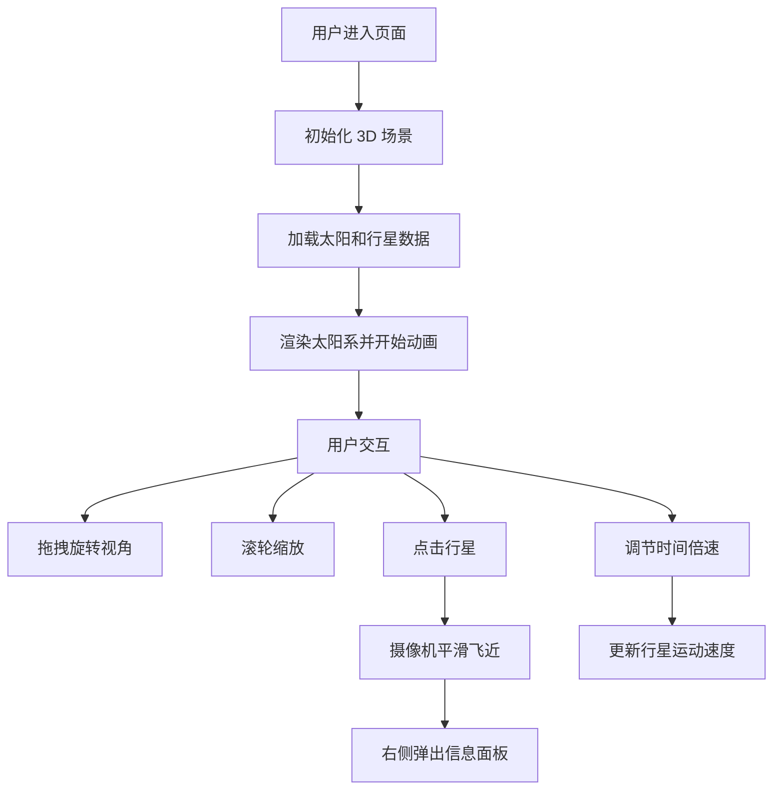

## 1. 产品概述

交互式 3D 太阳系探索器，让用户以沉浸式方式探索我们的太阳系。用户可以自由观察太阳和八大行星的运行，点击行星查看详细信息，并通过时间控制来观察天体运动。

- **核心价值**：将复杂的天文现象以直观的 3D 可视化方式呈现，兼具教育意义和视觉美感
- **目标用户**：天文爱好者、学生、教育工作者，以及对宇宙探索感兴趣的普通用户

## 2. 核心 Features

### 2.1 Feature Module

1. **主场景**：3D 太阳系可视化，包含太阳、八大行星及轨道
2. **交互控制**：鼠标拖拽旋转视角、滚轮缩放、点击行星聚焦
3. **信息面板**：行星详细数据展示
4. **时间控制**：时间倍速调节、暂停功能

### 2.2 Page Details

| 页面名称 | 模块名称      | 功能描述                                                         |
| -------- | ------------- | ---------------------------------------------------------------- |
| 主页面   | 3D 太阳系场景 | 展示太阳和八大行星，按真实比例缩放大小和轨道，行星按椭圆轨道公转 |
| 主页面   | 行星交互      | 点击行星后摄像机平滑飞近聚焦，右侧弹出信息面板                   |
| 主页面   | 信息面板      | 显示行星名称、直径、公转周期、自转周期、与太阳距离等数据         |
| 主页面   | 时间控制条    | 左下角时间控制，支持 0-100 倍速调节、暂停/播放                   |

## 3. Core Process

## 4. 用户界面设计

### 4.1 设计风格

- **整体风格**：复古未来主义（Retro-Futuristic），深色太空背景配合霓虹色调的 UI 元素
- **主色调**：深太空蓝 `#0a0a1a` 作为背景，配合霓虹青 `#00f5ff`、霓虹紫 `#9d4edd`、暖橙 `#ff9500` 作为点缀
- **字体**：标题使用 'Orbitron'（科幻风格等宽字体），正文使用 'Inter'
- **UI 元素**：半透明玻璃拟态面板，发光边框，像素级精确的几何形状
- **动画**：平滑的相机过渡、行星的缓动动画、信息面板的滑入效果

### 4.2 页面设计 Overview

| 页面名称 | 模块名称   | UI Elements                                                                                      |
| -------- | ---------- | ------------------------------------------------------------------------------------------------ |
| 主页面   | 3D 场景    | 黑色星空背景，行星使用程序化材质，轨道为半透明发光圆环，太阳有辉光效果                           |
| 主页面   | 信息面板   | 右侧滑入式面板，半透明深色背景，霓虹发光边框，标题使用霓虹青，数据使用白色，图标使用几何线条风格 |
| 主页面   | 时间控制条 | 左下角固定位置，半透明胶囊形状，包含播放/暂停按钮、倍速滑块、当前倍速显示                        |
| 主页面   | 提示文字   | 左上角简短操作提示，半透明文字                                                                   |

### 4.3 3D Scene Guidance

- **环境**：黑色太空背景，程序化生成的星点背景
- **光照**：太阳作为点光源发光，配合环境光确保行星背光面可见
- **相机**：PerspectiveCamera，初始位置在太阳系斜上方，可通过 OrbitControls 自由操控
- **交互**：点击行星使用 Raycaster 检测，相机飞行使用 GSAP 或自定义缓动函数
- **后处理**：太阳添加 Bloom 泛光效果增强视觉冲击力
- **性能**：行星使用 BufferGeometry，材质尽量复用，动态物体控制在 10 个以内

### 4.4 Responsiveness

- 桌面端优先设计，自适应不同分辨率
- 时间控制条和信息面板使用相对定位，确保在各种屏幕尺寸下位置合理
- Canvas 自适应窗口大小变化
