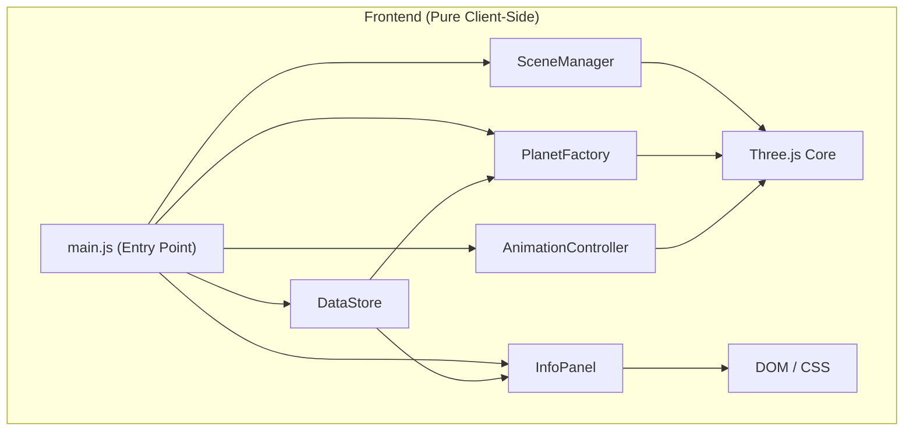

## 1. Architecture Design



## 2. Technology Description

- **前端框架**：Vanilla JavaScript (ES Modules) + Vite
- **3D 引擎**：Three.js ^0.160.0
- **相机控制**：Three.js OrbitControls
- **构建工具**：Vite ^5.0.0
- **样式**：原生 CSS + CSS Variables
- **无后端，纯前端项目**

### 目录结构

```
src/
├── core/
│   ├── DataStore.js          # 行星物理数据定义
│   ├── SceneManager.js       # 场景初始化、灯光、相机控制
│   ├── PlanetFactory.js      # 行星几何体、材质、轨道计算
│   └── AnimationController.js # 公转自转、时间倍速控制
├── ui/
│   └── InfoPanel.js          # 信息面板 UI 交互
├── main.js                   # 应用入口
└── style.css                 # 全局样式
```

## 3. 模块职责说明

### 3.1 DataStore.js
- 定义所有行星的物理数据（名称、直径、与太阳距离、公转周期、自转周期、颜色等）
- 数据按真实比例存储，提供缩放系数供其他模块使用
- 提供获取行星列表、按名称查找行星等方法

### 3.2 SceneManager.js
- 初始化 Three.js 场景、相机、渲染器
- 设置光照（点光源 + 环境光）
- 管理 OrbitControls 相机控制
- 处理窗口大小变化
- 管理点击事件和 Raycaster 检测

### 3.3 PlanetFactory.js
- 根据 DataStore 数据创建行星 Mesh（几何体 + 材质）
- 创建轨道线（EllipseCurve）
- 计算椭圆轨道参数
- 创建土星光环
- 生成太阳发光效果

### 3.4 AnimationController.js
- 管理动画循环（requestAnimationFrame）
- 控制时间倍速（0-100x）
- 更新行星公转位置
- 更新行星自转
- 提供播放/暂停/设置倍速等 API

### 3.5 InfoPanel.js
- 管理信息面板的 DOM 元素
- 处理面板的滑入/滑出动画
- 填充行星数据到 UI
- 处理关闭面板事件

### 3.6 main.js
- 初始化所有模块
- 绑定事件处理
- 启动动画循环

## 4. 核心算法说明

### 4.1 椭圆轨道计算
- 使用 Kepler 方程近似计算行星在椭圆轨道上的位置
- 轨道参数：半长轴 a、半短轴 b、偏心率 e
- 行星位置随角度 θ 变化：x = a * cos(θ), z = b * sin(θ)

### 4.2 真实比例缩放
- 大小缩放：以地球直径为基准（1 单位），其他行星按比例计算
- 距离缩放：轨道距离使用对数缩放以便于观察
- 时间缩放：公转周期以地球年为基准，按比例换算

### 4.3 相机平滑飞行
- 使用球面线性插值（Slerp）计算相机位置过渡
- 使用四元数（Quaternion）处理相机朝向过渡
- 缓动函数：easeInOutCubic

## 5. 数据模型定义

### Planet Data Model

```javascript
{
  name: String,           // 英文名称
  nameCN: String,         // 中文名称
  diameter: Number,       // 直径（km）
  distance: Number,       // 与太阳平均距离（百万 km）
  orbitalPeriod: Number,  // 公转周期（地球日）
  rotationPeriod: Number, // 自转周期（地球日）
  color: Number,          // 十六进制颜色值
  hasRings: Boolean,      // 是否有光环
  eccentricity: Number,   // 轨道偏心率
  description: String     // 简短描述
}
```
